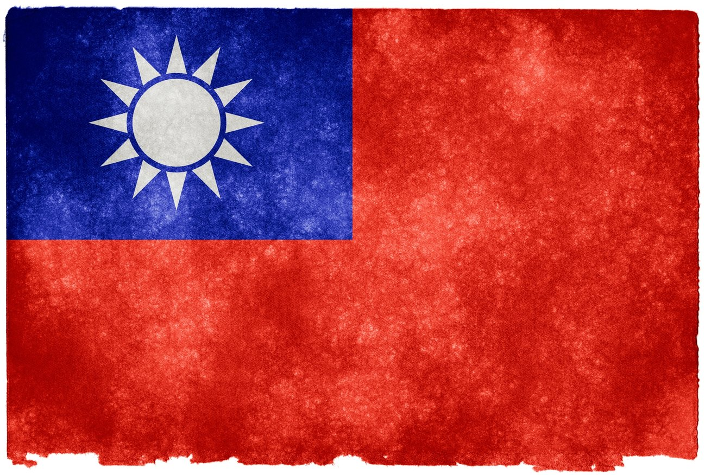

# 中華民國制省等級

## Attribution

* Reference: [JapanEx / zhung1206](https://zhung.com.tw/japanex)
* Reference: [Taiwan Travel Level / Tony Pai](https://github.com/tpai/taiwan-travel-level)
* Reference: [Taiwan Travel Level / mb10001114](https://github.com/mb10001114/taiwan-travel-level)
* Reference: [TaiwanEX / David Lu](https://github.com/yungshenglu/TaiwanEX/)
* Reference: [制县等级中国版 / Michael Tsang](https://github.com/miklcct/zhixian-dengji-zhongguo-ban)
* Map: [Map of China in 1946 / Milenioscuro](https://commons.wikimedia.org/wiki/File:China_in_1946.svg) / CC BY-SA 4.0
* Map: [Map of China in 1949 / Milenioscuro](https://commons.wikimedia.org/wiki/File:China_in_1949.svg) / CC BY-SA 4.0
* Background: [Taiwan Grunge Flag / Nicolas Raymond](https://www.flickr.com/photos/80497449@N04/7383295878) / CC 2.0
